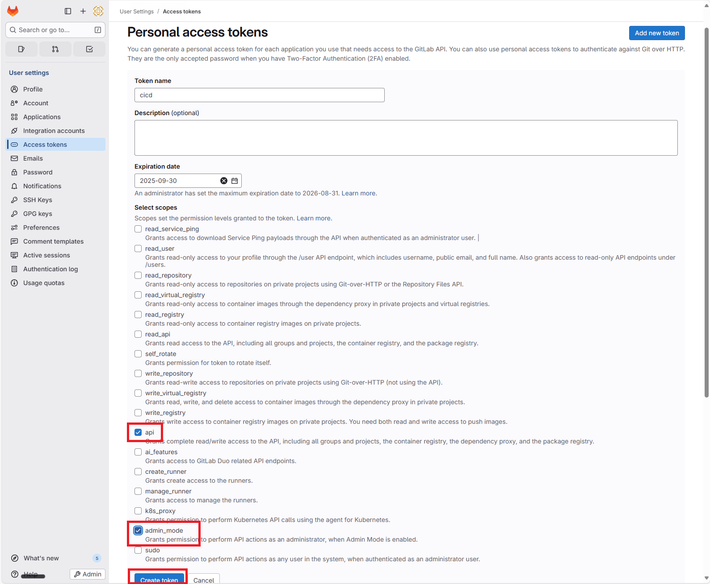

# Government Cloud IaC CI/CD with GitLab

## 概要

本リポジトリは、マルチアカウント IaC・CI/CD ワークショップ(https://catalog.us-east-1.prod.workshops.aws/workshops/f95fc450-f2bf-47e2-9834-11f1470cbfd1/ja-JP) を、GitLab 構成にリファクタリングしたものです。

## 従来のワークショップとの違い

### GitLab 用ドメインが必要

本ワークショップでは、GitLab と同じアカウントの Route53 にホストされていて、GitLab 用のレコードを登録出来るドメインが必要です。

AWS CodeConnections と GitLab の接続には TLS 暗号化が必須です。
GitLab のインストール中に名前解決出来ないと Let's Encrypt の設定が失敗してしまう為、今回はレコード設定を CDK のデプロイに組み込んでいます。

## 本ワークショップのアーキテクチャ


## デプロイの流れ

### 前提条件

以下のランタイムを使用します。各 OS ごとの手順に従いインストールしてください。

- [Node.js](https://nodejs.org/) (>= `18.0.0`)
  - `npm` (>= `8.1.0`)
- [Git](https://git-scm.com/)

### デプロイする順番

1. artifact-repository

   - デプロイ先
     - 共通運用管理環境
   - リソース
     - CDK 実行に必要な npm を管理する CodeArtifact
       - CICD 環境の CodeBuild からアクセスされる

2. gitlab

   - デプロイ先
     - CICD 環境
   - リソース
     - GitLab EC2 インスタンス
       - ソースコードリポジトリとして使用

3. cicd-pipeline

   - デプロイ先
     - CICD 環境
   - リソース
     - CI/CD 用 CodeCommit/CodeBuild/CodePipline

4. cdk-role

   - デプロイ先
     - 開発/検証/本番/共通運用管理環境
   - リソース
     - CDK 実行のための IAM Role
       - CICD 環境の CodeBuild が assume role する

## 導入手順

### 前提事項

Lab 1: CI/CDパイプライン環境のセットアップ を、本手順に置き換えます。

### 1. インフラ CI/CD のセットアップに必要なアセットのダウンロード

本 Lab の実施に必要なコード一式をダウンロードします。以下コマンドを実行して下さい。

> git clone https://github.com/issei-hamada/goverment-cloud-iac-cicd-with-gitlab.git

### 2. アセットの確認
ダウンロードしたファイルの配下にいくつかのディレクトリがあることを確認します。 下記はいずれも IaC (CDK) で実装されています。

**artifact-repository**

CDK 実行に必要な npm を管理する CodeArtifact
CI/CD 環境の CodeBuild からアクセスされる

**gitlab**

CI/CD 環境の コードリポジトリとして利用する GitLab と関連リソースを作成する

**cicd-pipeline**

CI/CD 用 CodeCommit/CodeBuild/CodePipline を作成

**cdk-role**

CDK 実行のための IAM Role
cicd-pipeline で作成した CodeBuild が assume role する

### 3. パッケージのインストール

Node.js の必要なライブラリをインストールします。

```sh

cd goverment-cloud-iac-cicd-with-gitlab
npm ci
```

### 4. artifact-repository をデプロイする

#### 4-1. デプロイパラメータを設定する

デプロイの際に必要となるデプロイ先アカウントなど、各ユースケース固有のパラメータを指定する必要があります。 `parameter.ts` というファイルでパラメータを管理します。書式は TypeScript です。

```sh
artifact-repository/parameter.ts
```

パラメータは以下の通りです。

| key               | value                                                                             |
| ----------------- | --------------------------------------------------------------------------------- |
| env               | デプロイ対象のアカウントとリージョン（指定しない場合は CLI の認証情報に従います） |
| accessibleAccount | CodeArtifact を使用する CICD 環境のアカウント                                     |

#### 4-2. デプロイする

初めて CDK を実行する場合は、対象のユースケースディレクトリへ移動し、CDK を bootstrap します。これは対象のアカウントとリージョンの組み合わせで初めて CDK を実行するときに必要です。

```sh
cd artifact-repository
npx cdk bootstrap
```

> NOTE:
>
> - ここではローカルの cdk を利用するため、`npx cdk` を使用しています。`npx` を使わず直接 `cdk` からコマンドを始めた場合は、グローバルインストールされた cdk が利用されます。

artifact-repository をデプロイします。

```sh
npx cdk deploy
```

#### 4-3. output を確認する

deploy が完了すると以下のような output が出力される。他の Stack で使用するためメモしておく。

```sh
Outputs:
Common-ArtifactRepository.RepositoryDomain = commonartifactrepositoryxxxxxxxx
Common-ArtifactRepository.RepositoryName = Npm
```

### 5. GitLab をデプロイする

#### 5-1. デプロイパラメータを設定する

GitLab EC2インスタンスのデプロイに必要なパラメータを設定します。

1. `gitlab/parameter.ts` ファイルでGitLab関連のパラメータを管理します。

    ```sh
    gitlab/parameter.ts
    ```

    GitLab関連のパラメータは以下の通りです。

    | key                    | value                                                                                   |
    | ---------------------- | --------------------------------------------------------------------------------------- |
    | env                    | デプロイ対象のアカウントとリージョン（指定しない場合は CLI の認証情報に従います）              |
    | gitlabInstanceType     | EC2インスタンスタイプ（デフォルト: t3.large）                                              |
    | gitlabVolumeSize       | EBSボリュームサイズ（GB）（デフォルト: 100）                                                |
    | gitlabKeyPairName      | 新規作成するキーペアの名前（デフォルト: 'GitLab'）                                          |
    | gitlabAllowedCidrBlocks| GitLabへのアクセスを許可するIPアドレス範囲のリスト                                          |
    | hostedZoneId           | Route53のホストゾーンID                                                                  |
    | domainName             | ドメイン名                                                                               |

    ホストゾーンID・ドメイン名は必須パラメータです。必ず指定して下さい。

2. ユーザデータ内の URL を書き換える
    ユーザデータ 16 行目の URL を、GitLab の接続 URL に書き換えて下さい。

    ```sh
    EXTERNAL_URL="https://gitlab.example.com" apt-get install -y gitlab-ee
    ```

#### 5-2. GitLab Stackをデプロイする

初めて CDK を実行する場合は、gitlabディレクトリへ移動し、CDK を bootstrap します。

```sh
cd gitlab
npx cdk bootstrap
```

GitLab EC2インスタンスをデプロイします。

```sh
npx cdk deploy
```

デプロイが完了すると、以下のような出力が表示されます：

```sh
Outputs:
GitLab.GitLabUrl = https://xxx.xxx.xxx.xxx
GitLab.InstanceId = i-xxxxxxxxxxxxxxxxx
GitLab.ElasticIp = xxx.xxx.xxx.xxx
GitLab.KeyPairName = GitLab
GitLab.SecurityGroupId = sg-xxxxxxxxxxxxxxxxx
GitLab.VpcId = vpc-xxxxxxxxxxxxxxxxx
```

> **重要**:
>
> - キーペアは自動的に作成されます。作成されたキーペアの秘密鍵は AWS Systems Manager Parameter Store に保存されます
> - 秘密鍵を取得するには: `aws ssm get-parameter --name /ec2/keypair/{key-pair-id} --with-decryption --query Parameter.Value --output text`

#### 5-3. GitLab へログイン

1. EC2 コンソールにて GitLab インスタンスを選択し、「接続」から「セッションマネージャ」で EC2 に接続します。

2. 以下コマンドを実行し、初期パスワードを確認します
    > sudo cat /etc/gitlab/initial_root_password

    ```sh
    $sudo cat /etc/gitlab/initial_root_password
    # WARNING: This value is valid only in the following conditions
    #          1. If provided manually (either via `GITLAB_ROOT_PASSWORD` environment variable or via `gitlab_rails['initial_root_password']` setting in `gitlab.rb`, it was provided before database was seeded for the first time (usually, the first reconfigure run).
    #          2. Password hasn't been changed manually, either via UI or via command line.
    #
    #          If the password shown here doesn't work, you must reset the admin password following https://docs.gitlab.com/ee/security/reset_user_password.html#reset-your-root-password.

    Password: xxxxxxxxxxxxxxxxxxxxxxxxxxxxxxxxxxxxxxxxx

    # NOTE: This file will be automatically deleted in the first reconfigure run after 24 hours.
    ```

    Password の値が、初期パスワードです。次の手順で利用する為、保存して下さい。

3. ユーザ名: root / パスワード: 前項で取得したパスワードを使って、GitLab へログイン

#### 5-4. GitLab グループ作成

1. ログイン後のトップページにて、左メニューの「Group」を選択
  

2. 画面中央右の「New group」を押下
  

3. 「Create group」を押下
  
  本 workshop では「development-group」として下さい。

4. 「Group name」を入力し、「Create group」を押下
  
  これでグループ作成は完了です。

#### 5-5. ワークショップ用プロジェクト作成

1. 左メニュー右上の「＋」アイコンをクリックし、「New project/repository」をクリック
  

2. 「Create blank project」をクリック
  

3. プロジェクト名を入力し、「Create project」を押下
  
  Project URL で、name space に 5-4 で作成したグループ名が入力されている事を確認する事。また、本 workshop ではプロジェクト名を「cicd-workshop」として下さい。

#### 5-6. パーソナルアクセストークンを払い出す

1. 左メニュー右上のユーザアイコンをクリックし、「Edit profile」をクリック
  

2. 左メニューの「Access tokens」をクリック
  

3. 右上の「Add new token」ボタンを押下
  

4. 「Select scope」にて「api」と「admin_mode」にチェックを入れ、「Create token」ボタンを押下
  
  token name は任意の値で問題ありません。

5. 「Your token」に表示されているトークンをコピーし、控える
  
  次の手順で利用します。

### 6. AWS CodeConnections を作成する

#### 6-1. 「接続」を作成

1. AWS コンソールの検索窓にて「CodePipeline」と入力し、サービスページへ移動

2. 左メニューの「設定」プルダウンから、「接続」を選択

3. 右上の「接続を作成」ボタンを押下
  

4. 「プロバイダーを選択する」にて「GitLab Self Managed」を選択し、接続設定を入力後、「GitLab Self Managedに接続」ボタンを押下
  
    - 接続名: 任意の値
    - URL: 作成した GitLab の URL を入力
    - 「VPCを使用」にはチェックを入れないで下さい

  現時点では、接続は「保留中」のステータスです。次の手順で承認作業を行います。

#### 6-2. GitLab にて AWS CodeConnections の接続を承認する

1. 先ほど作成した「接続」の、右上「保留中の接続を更新」ボタンを押下
  

2. ポップアップウィンドウが開く。テキストボックスに個人用アクセストークンを入力し、「続行」ボタンを押下
  

3. GitLab の認証画面が開く。「Authorize ~」ボタンを押下
  

4. 「ホストインスタンスでのインストールの確認」にて、「続行」を押下
  

5. 「接続」のステータスが「利用可能」になったら完了
  

6. 「接続設定」に記載されている ARN を控える

#### 補足: AWS CodeConnections を作成すると、GitLab 側にアプリケーションが作成される


- このアプリケーションを作成する為に、Personal Access Token が必要となっている
- アプリケーション作成後、Personal Access Token を削除して問題ない
- GitLab セルフマネージドへの接続を作成する: <https://docs.aws.amazon.com/ja_jp/dtconsole/latest/userguide/connections-create-gitlab-managed.html>

### 7. cicd-pipeline をデプロイする

#### 7-1. デプロイパラメータを設定する

以下パラメータファイルに、ARN とプロジェクト名を設定する

- goverment-cloud-iac-cicd-with-gitlab/cicd-pipeline/parameter.ts

```ts
  // CodeConnections parameters
  codeConnectionArn: 'arn:aws:codeconnections:ap-northeast-1:xxxxxxxxxxxx:connection/xxxxxxxxxxxx',
  gitlabTargetProject: 'development-group/cicd-workshop',
```

他パラメータの役割は以下の通りです。

| key                                     | value                                                                                                              |
| --------------------------------------- | ------------------------------------------------------------------------------------------------------------------ |
| env                                     | デプロイ対象のアカウントとリージョン（指定しない場合は CLI の認証情報に従います）                                  |
| commonAccount                           | 共通運用環境アカウント                                                                                             |
| developAccount                          | 開発環境アカウント                                                                                                 |
| stagingAccount                          | 検証環境アカウント                                                                                                 |
| productionAccount                       | 本番環境アカウント                                                                                                 |
| artifactRepositoryRegion                | artifact-repository をデプロイしたリージョン                                                                       |
| artifactRepositoryDomain                | artifact-repository のドメイン(artifact-repository デプロイ時の output)                                            |
| artifactRepositoryName                  | artifact-repository のリポジトリ名(artifact-repository デプロイ時の output)                                        |
| developBranch                           | 開発環境用のブランチ                                                                                               |
| stagingBranch                           | 検証環境用のブランチ                                                                                               |
| productionBranch                        | 本番環境用のブランチ                                                                                               |
| codeCommitRoles                         | CodeCommit を使用する IAM User がスイッチロールする Role 名                                                        |
| developCdkDeployRequireApproval         | 開発環境のデプロイ時の承認ステージの有無（必要：true,不要：false）                                                 |
| stagingCdkDeployRequireApproval         | 検証環境のデプロイ時の承認ステージの有無（必要：true,不要：false）                                                 |
| developCdkDeployApproverRoles           | 開発環境のデプロイ時の承認者用 IAM User がスイッチロールする Role 名                                               |
| stagingCdkDeployApproverRoles           | 検証環境のデプロイ時の承認者用 IAM User がスイッチロールする Role 名                                               |
| productionCdkDeployApproverRoles        | 本番環境のデプロイ時の承認者用 IAM User がスイッチロールする Role 名                                               |
| developCdkDiffOptions                   | 開発環境のテスト時の cdk diff のオプション                                                                         |
| developCdkDeployOptions                 | 開発環境のデプロイ時の cdk deploy のオプション                                                                     |
| stagingCdkDiffOptions                   | 検証環境のテスト時の cdk diff のオプション                                                                         |
| stagingCdkDeployOptions                 | 検証環境のデプロイ時の cdk deploy のオプション                                                                     |
| productionCdkDiffOptions                | 本番環境のテスト時の cdk diff のオプション                                                                         |
| productionCdkDeployOptions              | 本番環境のデプロイ時の cdk deploy のオプション                                                                     |
| pipelineNotifySlackWorkspaceId          | パイプラインのイベントを通知する Slack Workspace ID                                                                |
| developPipelineNotifySlackChannelId     | 開発環境用パイプラインのイベントを通知する Slack Channel ID                                                        |
| stagingPipelineNotifySlackChannelId     | 検証環境用パイプラインのイベントを通知する Slack Channel ID                                                        |
| productionPipelineNotifySlackChannelId  | 本番環境用パイプラインのイベントを通知する Slack Channel ID                                                        |
| developCdkDeployPipelineNotifyEvents    | 開発環境用デプロイパイプラインの通知対象イベントのリスト（何も指定しない場合は全てのイベントが通知される）         |
| stagingCdkDiffPipelineNotifyEvents      | 検証環境用テストパイプラインの通知対象イベントのリスト（何も指定しない場合は全てのイベントが通知される）           |
| stagingCdkDeployPipelineNotifyEvents    | 検証環境用デプロイパイプラインの通知対象イベントのリスト（何も指定しない場合は全てのイベントが通知される）         |
| productionCdkDiffPipelineNotifyEvents   | 本番環境用テストパイプラインの通知対象イベントのリスト（何も指定しない場合は全てのイベントが通知される）           |
| productionCdkDeployPipelineNotifyEvents | 本番環境用デプロイパイプラインの通知対象イベントのリスト（何も指定しない場合は全てのイベントが通知される）         |
| commonCdkDiffOptions                    | 共通運用管理環境のテスト時の cdk diff のオプション                                                                 |
| commonCdkDeployOptions                  | 共通運用管理環境のテスト時の cdk deploy のオプション                                                               |
| commonPipelineNotifySlackChannelId      | 共通運用管理環境用パイプラインのイベントを通知する Slack Channel ID                                                |
| commonCdkDeployPipelineNotifyEvents     | 共通運用管理環境用デプロイパイプラインの通知対象イベントのリスト（何も指定しない場合は全てのイベントが通知される） |
| commonCdkDeployRequireApproval          | 共通運用管理環境のデプロイ時の承認ステージの有無（必要：true,不要：false）                                         |
| commonCdkDeployApproverRoles            | 共通運用管理環境のデプロイ時の承認者用 IAM User がスイッチロールする Role 名                                       |
| cicdCdkDiffOptions                      | CICD環境のテスト時の cdk diff のオプション                                                                         |
| cicdCdkDeployOptions                    | CICD環境のテスト時の cdk deploy のオプション                                                                       |
| cicdPipelineNotifySlackChannelId        | CICD環境用パイプラインのイベントを通知する Slack Channel ID                                                        |
| cicdCdkDeployPipelineNotifyEvents       | CICD環境用デプロイパイプラインの通知対象イベントのリスト（何も指定しない場合は全てのイベントが通知される）         |
| cicdCdkDeployRequireApproval            | CICD環境のデプロイ時の承認ステージの有無（必要：true,不要：false）                                                 |
| cicdCdkDeployApproverRoles              | CICD環境のデプロイ時の承認者用 IAM User がスイッチロールする Role 名                                               |

#### 7-2. デプロイする

初めて CDK を実行する場合は、対象のユースケースディレクトリへ移動し、CDK を bootstrap します。これは対象のアカウントとリージョンの組み合わせで初めて CDK を実行するときに必要です。

```sh
cd cicd-pipeline
npx cdk bootstrap --profile cicd
```

> NOTE:
>
> - ここではローカルの cdk を利用するため、`npx cdk` を使用しています。`npx` を使わず直接 `cdk` からコマンドを始めた場合は、グローバルインストールされた cdk が利用されます。

cicd-pipeline をデプロイします。

```sh
npx cdk deploy --profile cicd
```

AWS::CodeStarNotifications::NotificationRule がエラーになる際は再度 deploy を実行してください。

#### 7-3. output を確認する

deploy が完了すろと以下のような output が出力される。他の Stack で使用するためメモしておく。

```sh
Outputs:
Cicd-Pipeline.DevelopCdkDeployCodeBuildRoleArn = arn:aws:iam::1111111111:role/Cicd-Pipeline-PipelineDevelopCdkDeployProjectXXXXXXXXXXXXXXXXXXX
Cicd-Pipeline.DevelopCdkDiffCodeBuildRoleArn = arn:aws:iam::1111111111:role/Cicd-Pipeline-PipelineDevelopCdkDiffProjectXXXXXXXXXXXXXXXXXXXXX
Cicd-Pipeline.ProductionCdkDeployCodeBuildRoleArn = arn:aws:iam::1111111111:role/Cicd-Pipeline-PipelineProductionCdkDeployProjectXXXXXXXXXXXXXXXX
Cicd-Pipeline.ProductionCdkDiffCodeBuildRoleArn = arn:aws:iam::1111111111:role/Cicd-Pipeline-PipelineProductionCdkDiffProjectXXXXXXXXXXXXXXXXXX
Cicd-Pipeline.StagingCdkDeployCodeBuildRoleArn = arn:aws:iam::1111111111:role/Cicd-Pipeline-PipelineStagingCdkDeployProjectXXXXXXXXXXXXXXXXXXX
Cicd-Pipeline.StagingCdkDiffCodeBuildRoleArn = arn:aws:iam::1111111111:role/Cicd-Pipeline-PipelineStagingCdkDiffProjectXXXXXXXXXXXXXXXXXXXXX
```

### 8. cdk-role をデプロイする

#### 8-1. デプロイパラメータを設定する

デプロイの際に必要となるデプロイ先アカウントなど、各ユースケース固有のパラメータを指定する必要があります。 `parameter.ts` というファイルでパラメータを管理します。書式は TypeScript です。

パラメータは以下の通りです。

| key                              | value                                                                             |
| -------------------------------- | --------------------------------------------------------------------------------- |
| env                              | デプロイ対象のアカウントとリージョン（指定しない場合は CLI の認証情報に従います） |
| accessibleAccount                | CodeArtifact にアクセスする CICD 環境のアカウント                                 |
| trustedCdkDiffCodeBuildRoleArn   | CICD 環境の CodeBuild が使用する Iam Role の arn                                  |
| trustedCdkDeployCodeBuildRoleArn | CICD 環境の CodeBuild が使用する Iam Role の arn                                  |

#### 8-2. デプロイする

初めて CDK を実行する場合は、対象のユースケースディレクトリへ移動し、CDK を bootstrap します。これは対象のアカウントとリージョンの組み合わせで初めて CDK を実行するときに必要です。

```sh
cd usecases/cdk-role
npx cdk bootstrap --profile dev
npx cdk bootstrap --profile stg
npx cdk bootstrap --profile prd
npx cdk bootstrap --profile common
```

> NOTE:
>
> - ここではローカルの cdk を利用するため、`npx cdk` を使用しています。`npx` を使わず直接 `cdk` からコマンドを始めた場合は、グローバルインストールされた cdk が利用されます。

artifact-repository をデプロイします。

```sh
npx cdk deploy --profile dev
npx cdk deploy --profile stg
npx cdk deploy --profile prd
npx cdk deploy --profile common
```

### 9. CDK コードを GitLab に push する

GitLabプロジェクトに develop/staging/production ブランチを作成します。
feature ブランチを作成し、開発/検証/本番環境へデプロイする CDK コードを push します。develop -> staging -> production ブランチとマージしていくことで各環境にコードがデプロイされます。

## Lab 2: ソース管理 以降の手順について

以降の手順は従来のワークショップと同じです。CodeCommit へのプッシュを、適宜 GitLab へのプッシュへと読み替えて実施して下さい。
